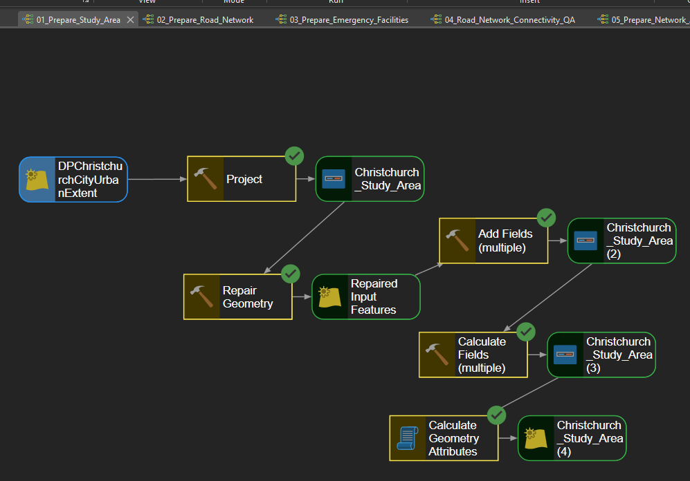
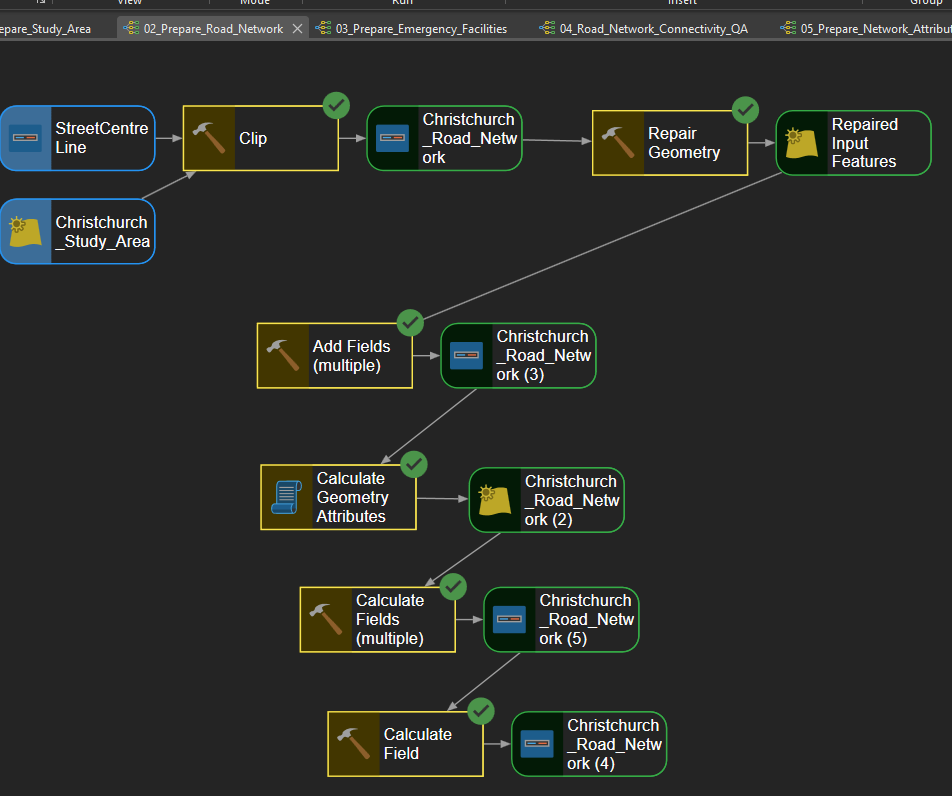
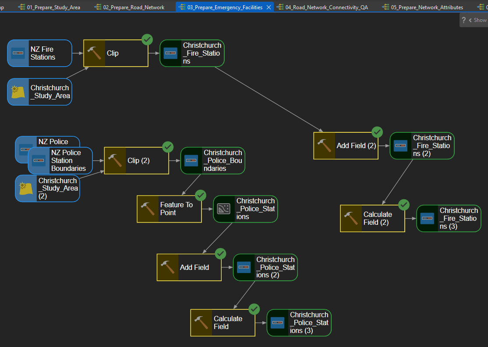
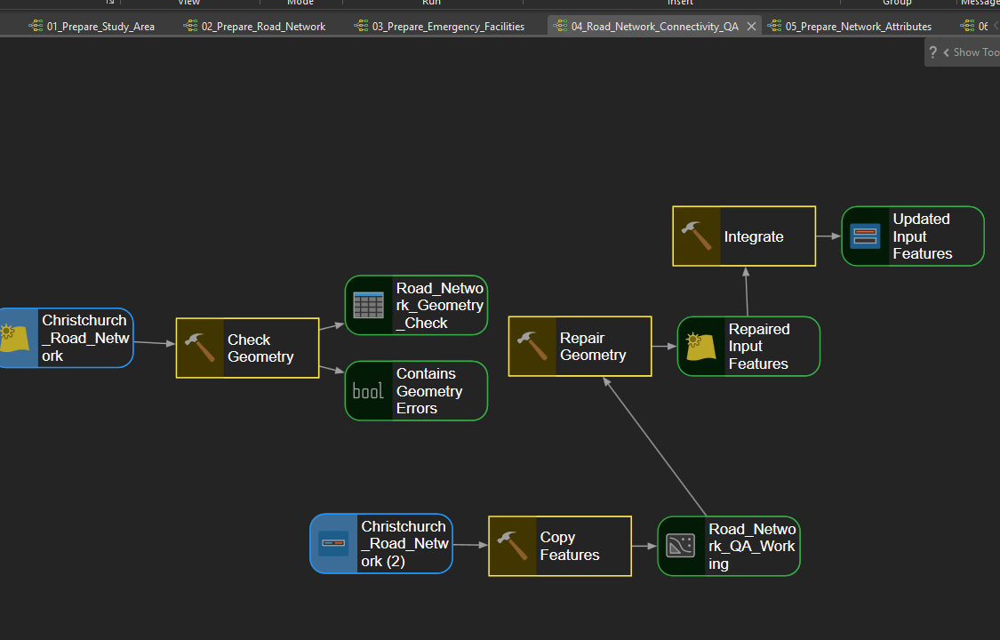
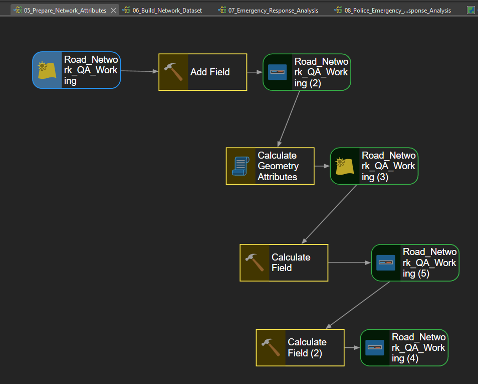
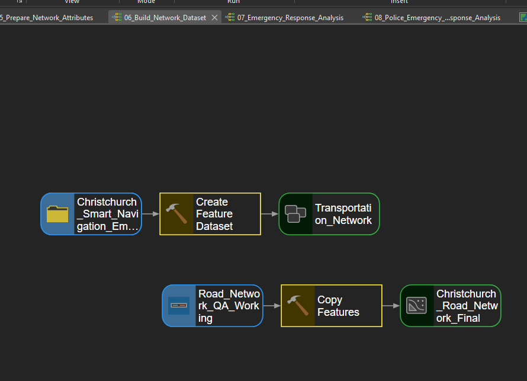
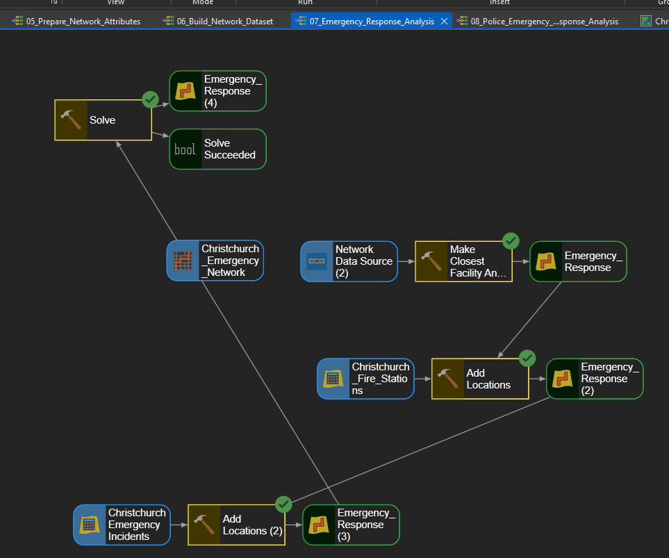
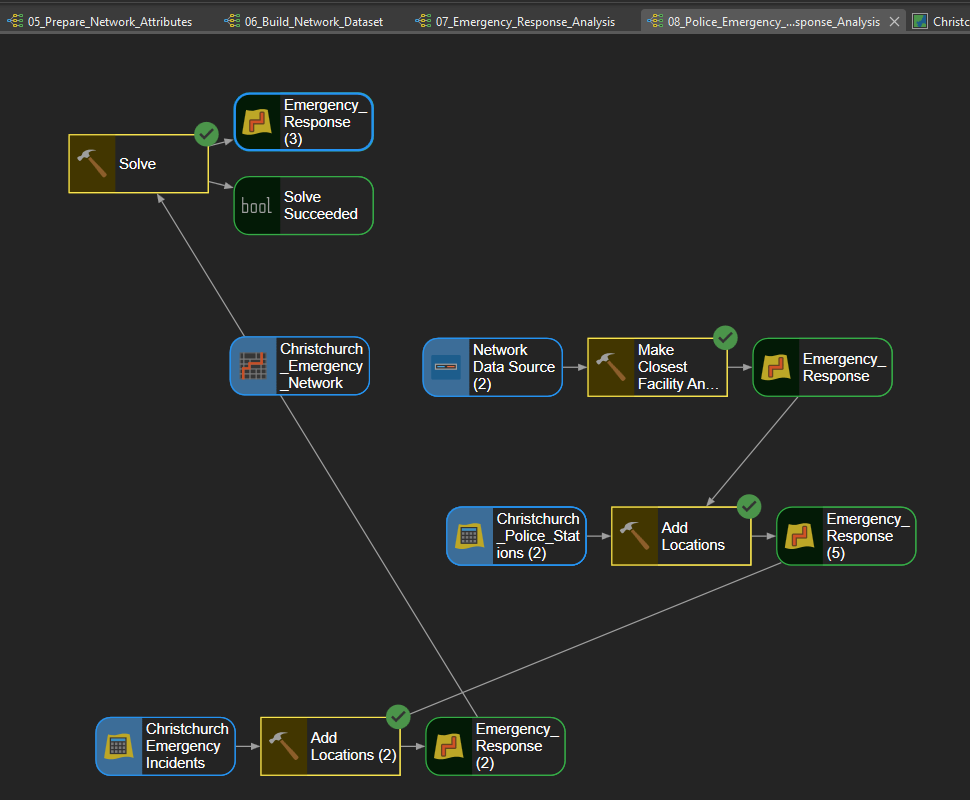

# Christchurch Smart Navigation & Emergency Response Network 2030

**Personal GIS Portfolio Project | Christchurch, New Zealand**

**GIS Analyst:** Mohammed Abdul Lateef  
**Date:** September 2026

## Project Overview

This project demonstrates an end-to-end GIS workflow for smart navigation and emergency response analysis in Christchurch, New Zealand.

The project integrates road network preparation, GIS QA/QC, Network Analyst, ModelBuilder automation, Closest Facility analysis, ArcGIS Online Web GIS, and an interactive ArcGIS Dashboard.

## Project Workflow

ArcGIS Pro → Road Network Preparation → GIS QA/QC → Network Dataset → Travel Time → ModelBuilder → Closest Facility Analysis → Fire & Police Response Routes → ArcGIS Online Web Map → Interactive Dashboard

## ModelBuilder Automation

Eight ModelBuilder workflows were developed to automate the preparation, QA/QC, network development, and emergency response analysis.

### 1. 01_Prepare_Study_Area

Prepares the Christchurch study boundary and establishes the geographic extent used throughout the project.  
The workflow projects the source data, repairs geometry, creates required fields, and calculates geometry attributes.

---

### 2. 02_Prepare_Road_Network

Prepares the Christchurch road network for routing and network analysis.  
The model clips roads to the study area, repairs geometry, creates required attributes, and calculates network-related fields.

---

### 3. 03_Prepare_Emergency_Facilities

Prepares fire and police station datasets for emergency response analysis.  
The workflow clips facility datasets, converts required features to points, and prepares attributes for network analysis.

---

### 4. 04_Road_Network_Connectivity_QA

Performs geometry and connectivity QA/QC on the prepared road network.  
The model checks geometry, repairs detected issues, creates a QA working dataset, and integrates connected road features.

---

### 5. 05_Prepare_Network_Attributes

Creates and calculates the road attributes required for network analysis.  
The workflow prepares road length, geometry, speed, and travel-time information used by the routing network.

---

### 6. 06_Build_Network_Dataset

Prepares the final road network structure used to construct the Christchurch Emergency Network Dataset.  
The model organizes the transportation feature dataset and produces the finalized network-ready road features.

---

### 7. 07_Emergency_Response_Analysis

Automates the fire emergency Closest Facility analysis using the Christchurch network dataset.  
Fire stations and the emergency incident are loaded into the analysis and solved to identify the optimized response route.

---

### 8. 08_Police_Emergency_Response_Analysis

Automates the police emergency Closest Facility analysis using the same network framework.  
Police stations and the emergency incident are loaded and solved to determine the optimized police response route.

## Emergency Response Results

| Response | Travel Time | Route Distance |
|---|---:|---:|
| Fire Emergency | 6.21 min | 2.85 km |
| Police Emergency | 9.09 min | 3.98 km |

## Technologies & Skills

- ArcGIS Pro
- ArcGIS Network Analyst
- ModelBuilder
- Network Dataset Development
- Closest Facility Analysis
- GIS Data QA/QC
- ArcGIS Online
- Web GIS
- ArcGIS Dashboards
- Emergency Response Routing

## Interactive Dashboard

Explore the completed public ArcGIS Dashboard:

https://www.arcgis.com/apps/dashboards/23a8026ce7374bf48eda961269ad7b62

## Project Deliverables

- 8 ModelBuilder workflows
- Christchurch Emergency Network Dataset
- Fire Emergency Response Route
- Police Emergency Response Route
- ArcGIS Online Web Map
- Interactive Emergency Response Dashboard
- 4-page Project Case Study

---

**Mohammed Abdul Lateef**  
GIS Analyst  
Personal GIS Portfolio Project
